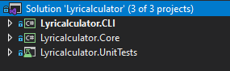
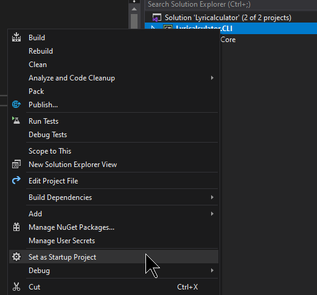
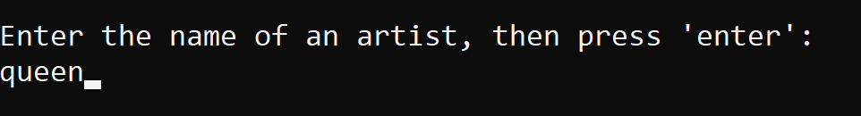
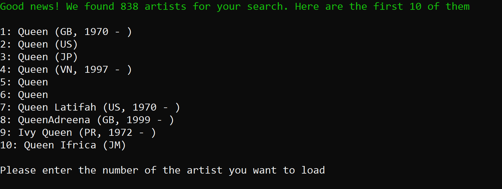
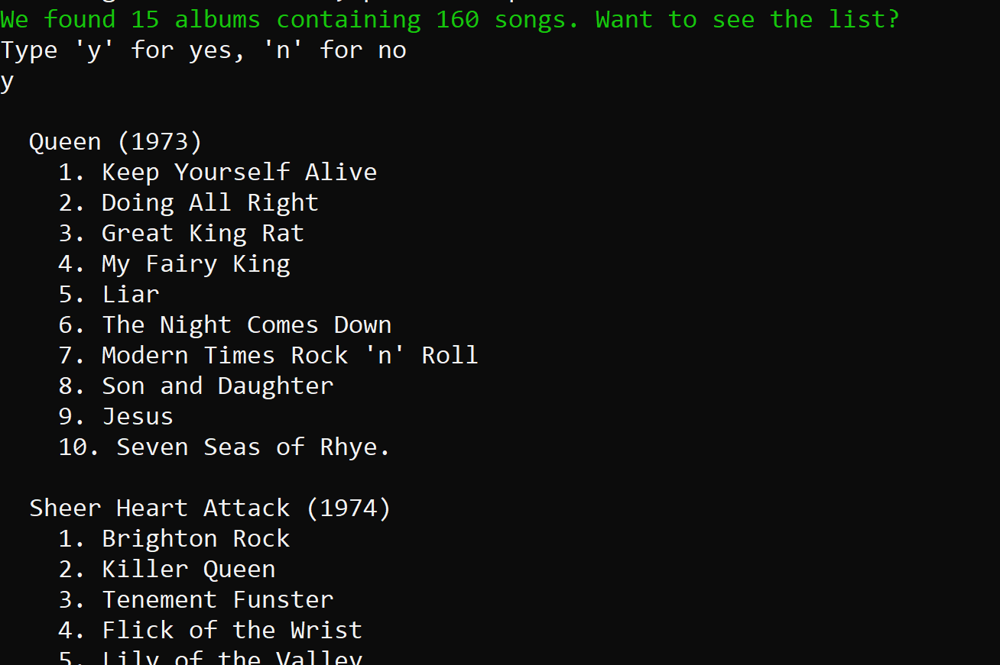
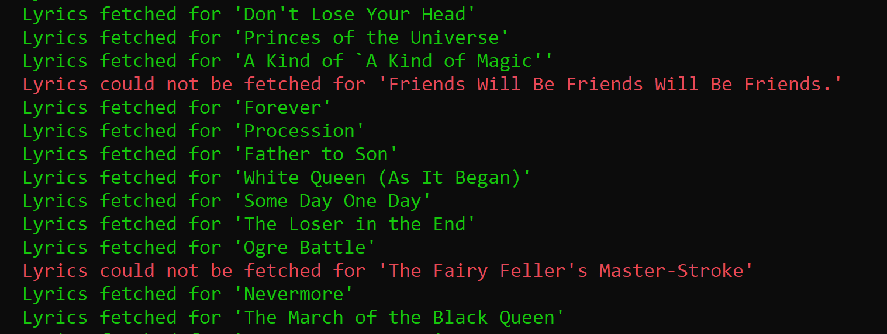
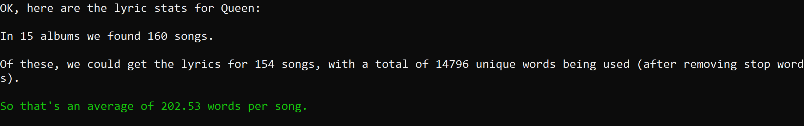

# Lyricalculator

Welcome to this hacky but fun project which uses the (MusicBrainz)[https://musicbrainz.org/doc/MusicBrainz_API] and (lyrics.ovh)[https://lyricsovh.docs.apiary.io/] APIs to fetch song lyrics for an artist and calculate some basic stats on them.

There's no machine learning or anything too clever here, so expect there to be bugs. For example, this project will say that the longest word found in David Bowie's lyrics is "Ch-ch-ch-ch-ch-changes". _C'est la vie_.

## Running the project

The easiest way is to run the solution in Visual Studio. You can download a [free community version here](https://visualstudio.microsoft.com/free-developer-offers/), or there's a [free virtual machine with Visual Studio installed available to download here](https://developer.microsoft.com/en-us/windows/downloads/virtual-machines/).

Clone the repo to your machine and open `Lyricalculator.sln`. You should see the two projects in the Solution Explorer:

- Lyricalculator.CLI is a console app which allows you to look up artists, fetch songs and lyrics, and displays the stats
- Lyricalculator.Core is the heart of the project, where the logic for calling the APIs and calculating stats is based

Right-click the Lyricalculator.CLI project and choose 'Set as startup project':

You should now be able to press `F5` and run the app.

Experienced users of Visual Studio will know there are various ways to run console apps, so feel free to use the way that is most comfortable for you.

## Using the app

### Finding an artist

First the app will ask you for the name of an artist:

And will show you the artists who match that name:

Enter the number of the artist - generally this is the top one, so number 1 - and press enter.

Some basic details about the artist are shown, and then you are asked if you want to fetch albums. This can take a while, so please be patient.

### Fetching albums

There is no feedback (except for a small spinner) while the app fetches albums and songs from the MusicBrainz API. When it is finished fetching albums and songs you get the option to display the list. Here's what that looks like:

### Fetching lyrics

Now we are ready to fetch the lyrics for all the songs from the lyrics.ovh API. This can take a long time (see more below about performance) but you'll get feedback about whether the lyrics for each song can be found:

### Displaying stats

Once all the lyrics are fetched the app will calculate and display the stats:

## App architecture

I wanted to keep the architecture for this app simple, as there's no need to overcomplicate it. I also had limited time.

The `Core` project contains a class called `MusicService` which has the following public methods:

- `SearchArtists(string name, int limit = 10)`
- `GetAlbums(Artist artist)`
- `GetLyrics(Artist artist, Song song)`
- `CalculateStats(Artist artist)`

This could easily be used in a RESTful API, or called by other types of apps (e.g. a graphical user interface).

In these method signatures you can also see some of the models used in the app:

- `Artist`
- `Album`
- `Song`
- A few more, for storing stats etc

## High-level process

The process, therefore, is as follows:

1. Find the artist
2. Get the albums and songs for the artist
3. Get the lyrics and calculate basic stats
4. Calculate stats for all songs

It would be possible to wrap all this up into a single method call:

`CalculateStats(string name)`

Which would automatically do all that work for the first artist found with the given name. However that would have been very slow, with little chance of user feedback.

## Lyrics parsing

There is a class which is responsible for parsing lyrics and generating basic stats on a per-song basis. The lyrics and these stats are cached, so the calculation of stats over an artists entire set of songs is relatively quick.

This class does nothing very clever; it removes stop words ('and', 'the'), words of insufficient length, and common punctuation. It then does a basic split on spaces to get the words. The stop words, length limit, and list of punctuation charaters, are all in a settings file in the CLI project.

This could clearly be a lot better, especially as in my testing I got a lot of very dubious results (the 'ch-ch-ch-ch-ch-changes' example springs to mind).

## Performance

Clearly performance is a problem, as the APIs require many calls in order to get all the data required.

In several places it would have been possible to write some multi-threaded code to reduce the overall time taken to get the data, however I was wary of hammering the APIs and getting banned. That would not have been a good look. Instead I opted for basic loops, sequentially calling the APIs for each album or song.

I also have to admit I found the MusicBrainz API a little confusing - they have a more complex model than I expected (release groups, releases, media, recordings etc etc) so there may be more efficient ways of querying their API than I have employed.

So subsequent requests for the same artist are quicker, the list of albums (with song metadata) and the details for each song (lyrics and stats) are cached with a simple file-based cache.

If this were a "proper" system I would certainly have stored these in some kind of document database; probably Elasticsearch, so I could take advantage of it's advanced text parsing.

## Further developments

A lot more interesting stats could be gleaned even from the current data, for example:

- Average number of words per album
- Average number of words in songs released each year
- Words beginning with different letters
- Number of words of different lengths (this is calculated per-song, but not used in the aggregate statistics)

And with some cleverer text parsing using sentiment analysis, stats on how 'happy' or 'sad' songs are could be calculated. We could also calculate whether the writer is getting more or less self-obsessed over their career.

## Wrapping up

OK, this has been a fun little project to work on. I freely admit the code is quick and dirty, so please bear that in mind as you look at it!